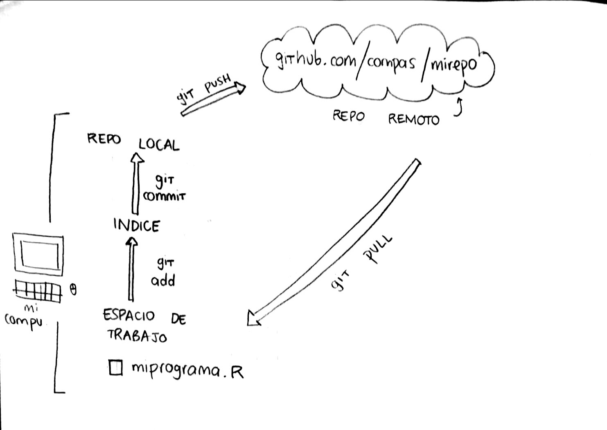

#Github

##¿Qué es Github?

GitHub es una plataforma para alojar proyectos que utiliza el sistema de control de versiones git.

Aunque es la más popular, no es la unica. Existen otras plataformas como BitBucket que también permiten realizar tareas similares.

### Entonces... ¿Qué es Git?

* Git es un sistema de control de versiones que sirve para dar seguimiento a los cambios en los archivos de una computadora y coordinar el trabajo de esos archivos entre multiples personas. 

* Principalmente es usado para el desarrollo de software, aunque puede ser usado para mantener un seguimiento de cualquier archivo.

* Git fue creado en el año 2005 por Linus Torvalds (Sí, por él Linux tiene ese nombre) para coordinal el desarrollo del kernel Linux.

## ¿Por qué usar Github?

* Versionar tu código
* Aprender y experimentar
* Contribuir
* Trabajo en equipo
* Estar informado(a)
* Visor de código
* Mostrar tus conocimientos
* Registro de incidencias
* Compatibilidad
* Precio (Es gratis para repositorios públicos)

*Para una mayor exposición de cada punto https://gist.github.com/equintana/57a55dfb0337f5cd15cd*

##Abre tu cuenta de Github

Antes que nada crea una cuanta de [Github](https://github.com/).

## Instalación de git

En [esta](https://git-scm.com/downloads) página puedes encontrar todo lo referente a la instalación de git sin importar cual sea tu sistema operativo.  

##Diferencia entre repo local y repo remoto

##¿Qué es un repositorio?

El repositorio es un sitio donde se almacena y se mantiene información digital. Para efectos de este curso existen dos tipos de repositorios: el remoto y el local.
-El repositorio remoto es aquel que esta alojado en los servidores de Github y al cual cualquier persona con permisos puede acceder. 
-El repositorio local es aquel que se encuentra en el ordenador.

Entre ambos suele haber una interconexión, lo cual permite actualizar información desde un repo local a uno remoto y viceversa. 

##Pasos básicos en Github (Página de internet)

Si ya hay un repositorio en el cual estes interesado y deseas copiarlo a tus repositorios, es necesario hacer un **fork**. De esta manera, será posible hacer cambios que posteriormente podran ser integrados al proyecto original o podrán desembocar en un nuevo proyecto diferente. 

Todo cambio que se quiera hacer a los repositorios se realizará desde la propia computadora.

Una vez que todos los cambios han sido realizados en el repositorio local y se ha mandado al repositorio remoto de Github, se puede pedir al propietario del repositorio original que integre los cambios hechos, esto mediante un **pull request**.

##Comandos básicos de git en la computadora

> git clone "https://github.com/<Nombre_Usuario>/<repo_a_clonar>/"
Clona completamente en tu computadora el repositorio remoto de esa dirección. (Se puede clonar el repo de cualquier usuario, aunque debe de considerarse que si se clona el repo de otro usuario no se podra hacer un git push a menos de que se posean las credenciales de ese usuario ya que lo que se estaria intentando sería guardar nuestros cambios en un repo ajeno)

> git pull

Actualiza a la computadora los cambios realizados en el repositorio remoto.

- > git remote -v
Revisa los distintos repos remotos con los que está conectado tu repo local.

- git status
Indica el estado de los archivos. Si se ha modificado algun archivo, si todo está en orden, etc. Comúnmente se usa antes de hacer git push para verificar que los cambios se subiran correctamente al repositorio remoto.  

- git add .
Añade los cambios de todos los archivos para que puedan ser subidos al repositorio remoto. También podemos agregar nuestros cambios archivo por archivo, si queremos tener más control sobre lo que agregamos.

- git commit -m "Mensaje"
Después de haber modificado los archivos y de haberlos añadidos con un git add se ejecuta este comando para añadir un pequeño mensaje indicando que fue lo que se hizo.   

- git push
Sube la rama al repositorio remoto. Al ejecutarlo se pedirá tu nombre de usuario y contraseña para poder guardarlo en tu repositorio de github.

